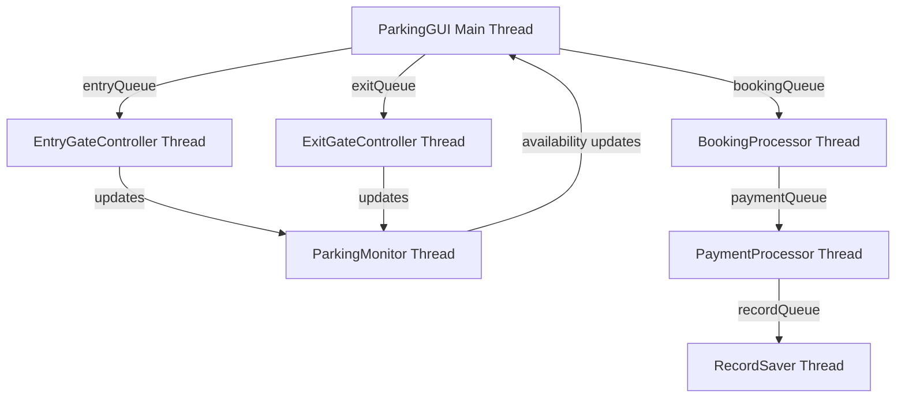
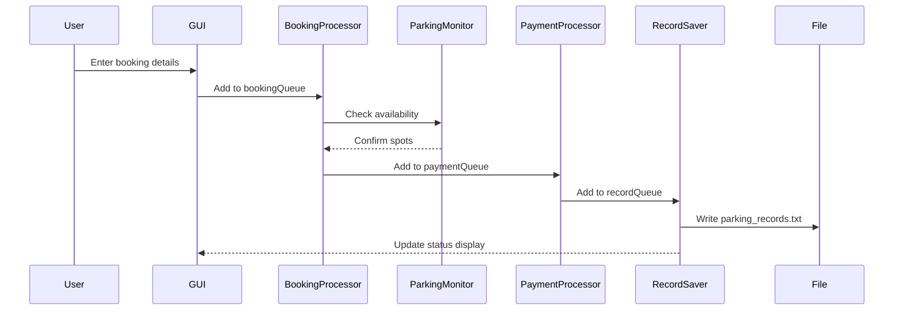

# Campus Parking Spot Booking App - Implementation Plan

## Architecture Overview

This application implements a concurrent parking management system with 6 active threads communicating through BlockingQueues:




## Thread Communication Flow




## Implementation Steps

### 1. Create Project Structure

Create the following directory structure:

```javascript
campus-parking-spot-booking/
├── src/
│   ├── BookingRequest.java
│   ├── BookingProcessor.java
│   ├── EntryGateController.java
│   ├── ExitGateController.java
│   ├── ParkingMonitor.java
│   ├── PaymentProcessor.java
│   ├── RecordSaver.java
│   └── ParkingGUI.java
└── parking_records.txt (created at runtime)
```


### 2. Data Model Class

**[src/BookingRequest.java](src/BookingRequest.java)**

- Simple POJO with fields: name, vehiclePlate, zone, spotType, dateTime, spotNumber
- Include getters/setters and toString()
- Add status field (PENDING, CONFIRMED, ENTERED, EXITED)

### 3. Core Threading Classes

**[src/BookingProcessor.java](src/BookingProcessor.java)** (implements Runnable)

- Consumes from `BlockingQueue<BookingRequest> bookingQueue`
- Validates booking against available spots via synchronized method
- Assigns specific spot numbers (e.g., "A-15")
- Thread.sleep(500) to simulate processing
- Produces to `paymentQueue` after successful booking
- Uses while loop checking volatile boolean `running` flag

**[src/ParkingMonitor.java](src/ParkingMonitor.java)** (extends Thread)

- Maintains synchronized HashMap<String, Integer> for spot availability
- Zone A: 20 spots, Zone B: 15 spots, Zone C: 10 spots
- Continuous monitoring loop with Thread.sleep(1000)
- Provides synchronized methods: checkAvailability(), reserveSpot(), freeSpot()
- Updates GUI via callback interface for real-time display

**[src/EntryGateController.java](src/EntryGateController.java)** (implements Runnable)

- Consumes from `BlockingQueue<BookingRequest> entryQueue`
- Verifies booking status before allowing entry
- Thread.sleep(300) to simulate gate opening
- Updates spot occupancy via ParkingMonitor.markEntered()
- Logs entry time for payment calculation

**[src/ExitGateController.java](src/ExitGateController.java)** (implements Runnable)

- Consumes from `BlockingQueue<BookingRequest> exitQueue`
- Frees parking spots via ParkingMonitor.freeSpot()
- Triggers payment if not pre-paid
- Thread.sleep(300) to simulate gate operation
- Produces to `paymentQueue` if payment needed

**[src/PaymentProcessor.java](src/PaymentProcessor.java)** (implements Runnable - SINGLE THREAD)

- Consumes from `BlockingQueue<BookingRequest> paymentQueue`
- Calculates fees: Regular (RM3/day), VIP (RM8/day), Disabled (RM2/day)
- Simple single-threaded processing (NO nested ExecutorService)
- Thread.sleep(400) to simulate payment gateway
- Produces formatted records to `recordQueue`

**[src/RecordSaver.java](src/RecordSaver.java)** (implements Runnable)

- Consumes from `BlockingQueue<String> recordQueue`
- Appends to parking_records.txt using synchronized FileWriter
- Thread.sleep(100) to manage file I/O
- Format: `[2026-01-04 12:30] Student: John Doe | Vehicle: ABC1234 | Zone: A | Spot: A-15 | Fee: RM5.00`

### 4. GUI Implementation

**[src/ParkingGUI.java](src/ParkingGUI.java) **(extends JFrame)**Components:**

- Input panel (top):
- JTextField for name
- JTextField for vehicle plate
- JComboBox for zone selection (A, B, C)
- JComboBox for spot type (Regular, VIP, Disabled)
- JSpinner for date selection
- JSpinner for time selection (HH:MM format)
- Action panel (middle):
- "Book Spot" JButton
- "Simulate Entry" JButton  
- "Simulate Exit" JButton
- "Exit Application" JButton
- Status panel (bottom):
- JTextArea with JScrollPane for thread activity log
- JLabels showing available spots per zone (updated by ParkingMonitor)

**Thread Management:**

- Initialize all 6 BlockingQueues (LinkedBlockingQueue with capacity 50)
- Create and start() all worker threads in constructor
- Implement WindowListener for graceful shutdown
- On close: interrupt all threads, call join() with timeout, shutdown ExecutorService

**Event Handlers:**

- Book button: validate inputs, create BookingRequest, add to bookingQueue
- Entry button: select from active bookings, add to entryQueue
- Exit button: select from entered vehicles, add to exitQueue
- "Generate Test Data" button: creates 5 sample bookings instantly
- All actions update JTextArea via SwingUtilities.invokeLater()

### 5. Synchronization Mechanisms

- **ParkingMonitor**: All spot allocation methods synchronized
- **RecordSaver**: Synchronized file writing
- **Thread-safe communication**: All inter-thread data via BlockingQueues
- **GUI updates**: Use SwingUtilities.invokeLater() from worker threads

### 6. Exception Handling & Logging Standards

**InterruptedException Handling (REQUIRED IN ALL THREADS):**

- Wrap ALL Thread.sleep() calls in try-catch blocks
- Wrap ALL BlockingQueue.take()/put() calls in try-catch blocks
- On interrupt: log "[HH:mm:ss] ThreadName: Interrupted, shutting down gracefully"
- Break from loops and cleanup resources
- Re-set interrupt status if needed: Thread.currentThread().interrupt()

**Status Message Format (MANDATORY):**All status messages MUST follow this format:

```javascript
[HH:mm:ss] ThreadName: Descriptive message
```

Examples:

- `[14:23:15] BookingProcessor: Processing booking for John Doe...`
- `[14:23:16] ParkingMonitor: Zone A - 15 spots available`
- `[14:23:17] PaymentProcessor: Payment of RM5.00 completed`
- `[14:23:18] RecordSaver: Saved record to file`

**GUI Updates (CRITICAL):**

- ALL GUI updates from worker threads MUST use SwingUtilities.invokeLater()
- This includes: JTextArea appends, JLabel updates, status changes
- Never directly modify GUI components from non-EDT threads

**File I/O Exception Handling:**

- Catch IOException in RecordSaver
- Log errors to GUI via SwingUtilities.invokeLater()
- Continue operation even if file write fails

### 7. Testing Scenarios

After implementation, test:

- Multiple simultaneous bookings (create 5+ bookings quickly)
- Entry/exit flow for different zones
- Payment calculation accuracy
- File persistence (check parking_records.txt)
- Thread-safe spot allocation (no double-booking)
- Graceful shutdown (all threads terminate cleanly)

## Key Implementation Details

**BlockingQueue Connections:**

- `bookingQueue`: GUI → BookingProcessor
- `entryQueue`: GUI → EntryGateController  
- `exitQueue`: GUI → ExitGateController
- `paymentQueue`: BookingProcessor/ExitGateController → PaymentProcessor
- `recordQueue`: PaymentProcessor → RecordSaver

**Parking Rates:**

- Regular: RM3.00/day
- VIP: RM8.00/day
- Disabled: RM2.00/day
- Peak hours (8AM-10AM, 5PM-7PM): +50% surcharge

**Thread Lifecycle & Graceful Shutdown:**

1. **Initialization (in ParkingGUI constructor):**

- Set volatile boolean `running = true` for each thread
- Call `thread.start()` to begin execution
- WHY: .start() creates new thread context and calls run() asynchronously

2. **During Execution:**

- Each thread runs while(running) loop
- Use BlockingQueue.take() for thread-safe data retrieval
- Use Thread.sleep(ms) to simulate real-world processing delays
- WHY: Simulates network latency, database queries, hardware delays

3. **Graceful Shutdown (on window close):**
   ```java
                     // Step 1: Signal all threads to stop
                     running = false;
                     
                     // Step 2: Interrupt blocked threads (waiting on queue.take() or sleep)
                     bookingProcessorThread.interrupt();
                     entryGateThread.interrupt();
                     // ... interrupt all threads
                     
                     // Step 3: Wait for clean termination (2 second timeout)
                     try {
                         bookingProcessorThread.join(2000);
                         entryGateThread.join(2000);
                         // ... join all threads
                     } catch (InterruptedException e) {
                         // Log timeout
                     }
                     
                     // Step 4: Force exit
                     System.exit(0);
   ```


- WHY join(): Waits for thread to finish cleanup before terminating JVM
- WHY interrupt(): Wakes threads blocked on I/O or sleep operations
- WHY timeout: Prevents infinite waiting if thread hangs

## Deliverables

1. Eight fully-commented Java source files in src/
2. Executable main class (ParkingGUI.java with main method)
3. Runtime-generated parking_records.txt
4. Detailed comments explaining every thread operation

## Critical Documentation Requirements in Code

Every thread class MUST include comments explaining:

1. **WHY Thread.sleep() is used:**
   ```java
                     // Simulate payment gateway processing time (network latency)
                     Thread.sleep(400);
   ```


2. **WHY BlockingQueue is used:**
   ```java
                     // BlockingQueue.take() blocks until data available - thread-safe consumer pattern
                     // Prevents busy-waiting and provides automatic synchronization
                     BookingRequest request = bookingQueue.take();
   ```


3. **WHY synchronized methods are used:**
   ```java
                     // Synchronized to prevent race condition: two threads booking same spot
                     public synchronized boolean reserveSpot(String zone) { ... }
   ```


4. **WHY SwingUtilities.invokeLater() is used:**
   ```java
                     // GUI updates must run on Event Dispatch Thread to prevent threading issues
                     // Worker threads cannot directly modify Swing components
                     SwingUtilities.invokeLater(() -> statusArea.append(message));
   ```


5. **WHY thread.join() is used:**
   ```java
                     // Wait for BookingProcessor to finish current transaction before shutdown
                     // Prevents data loss and ensures file writes complete
                     bookingProcessorThread.join(2000);
   ```


6. **WHY thread.interrupt() is used:**
   ```java
                     // Interrupt signal wakes threads blocked on queue.take() or Thread.sleep()
                     // Allows graceful shutdown instead of forcing thread termination
                     bookingProcessorThread.interrupt();
               
            
         
      
   
   ```